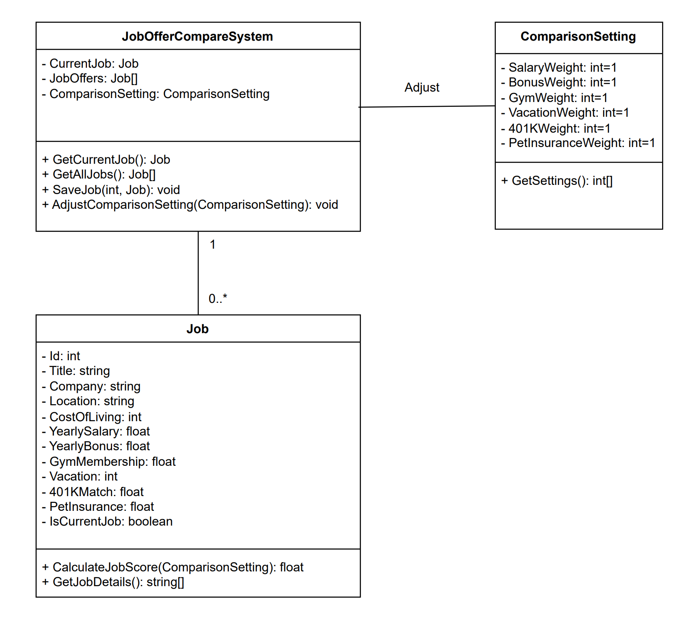
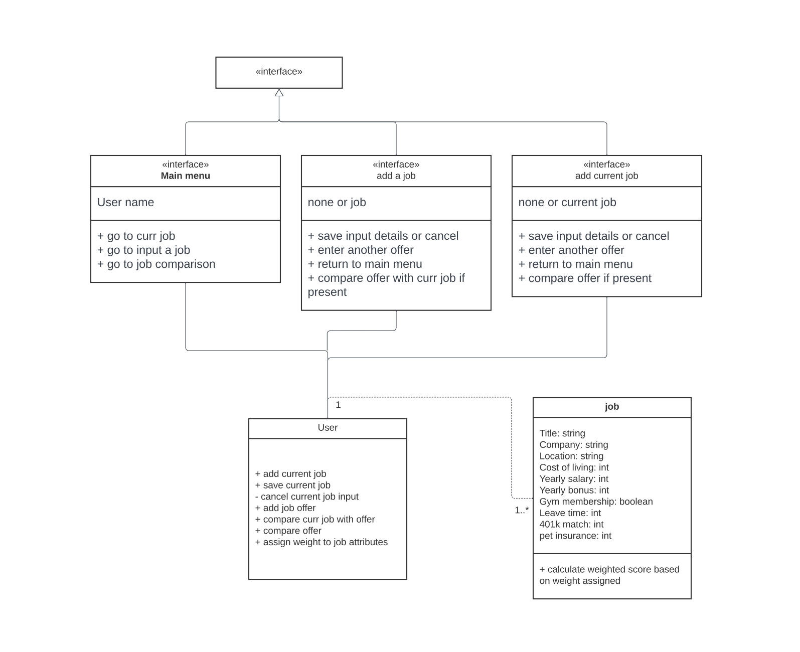
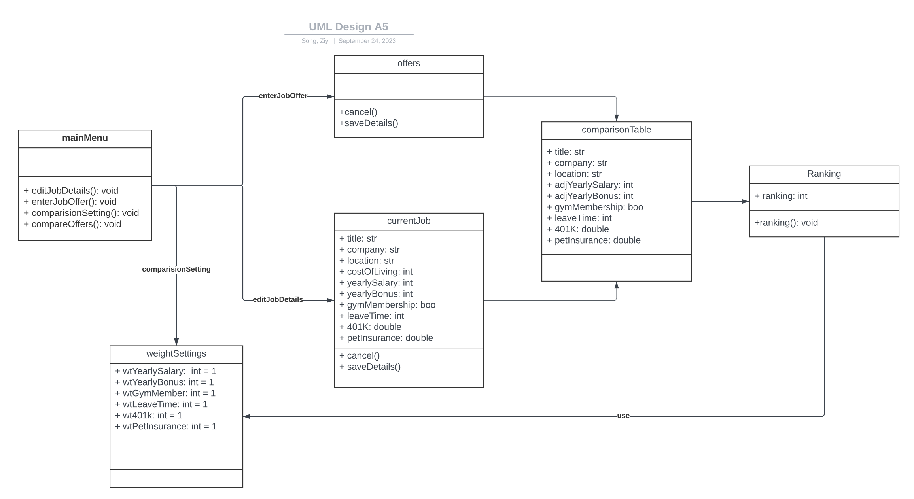
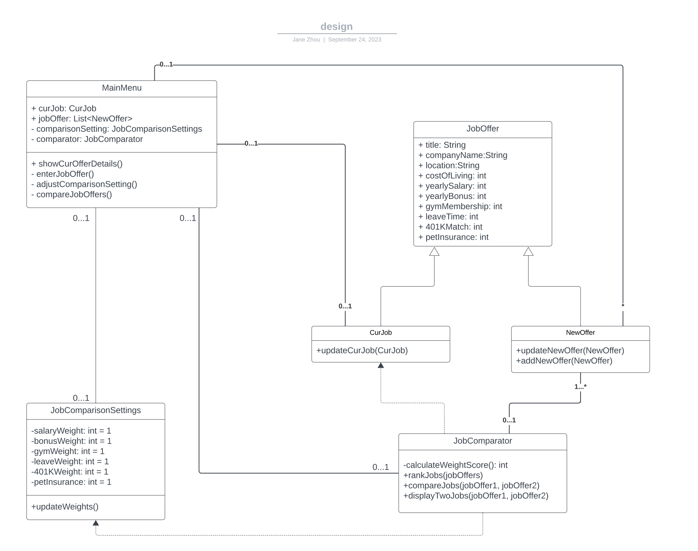

# Section 1 - Individual Design
## Design 1 (cruan31)

* Pros 

  1. Overall design is pretty simple and easy to follow. 

  2. Having a unified `Job` class can make `CurrentJob` and `JobOffer` use the same class and can be distinguished by the `IsCurrentJob` property. 

  3. Use `CalculateJobScore` function to calculate the scores when needed. 

  4. All properties are private so that the object can’t be modified accidentally. 

  5. All data is controlled by the `JobOfferCompareSystem` class, which is simple and easy to manage. 

* Cons 

  1. Some logics are hidden like when representing all the offers, the returned array is already sorted by calling the `CalculateJobScore` function. 

  2. `AdjustComparisonSetting` function will create a new instance of `ComparsionSetting`, which may waste memorry.  

## Design 2 (xfu89)

* Pros 

  1. Identified Job as a class 

  2. The attributes of job are clearly listed with details demonstrating necessary requirements listed in the assignment 

* Cons 

    1. The interface should not be considered when designing UML 

    2. The public or private notation for functions is not correctly defined 

## Design 3 (zsong49)

* Pros 

  1. Design follows common sense and logic, intuitive to follow. 

* Cons 

  1. Design did not differentiate between public and private. 

  2. Returns of functions are not expressed clearly. 

  3. `MainMenu` is an interface, not a class. So, it shouldn’t show up in the UML design. 

  4. Some attributes and operations are not put in correct places. 

## Design 4 (yzhou892)

* Pros 

  1. The design is very detailed and clear to cover all the requirements of the app. 

  2. The relationship between each class makes sense. 

* Cons 

  1. The ‘MainMenu’ should be a part of UI design but not a class. 

  2. There is no need to separate the current job and new offers because they share the same attributes and functions. 

  3. The design didn’t distinguish very clearly between the private and public attributes or operations. 

  4. Some of the input and output of the operations are unclear. 

# Section 2 - Team Design

## Commonalities  

  1. All the designs have ‘Job’ and ‘ComparsionSetting’ class.  

## Differences 

  1. The final team design doesn’t make the ‘MainMenu’ as a separate class since it should be a part of UI design. 

  2. The final team design doesn’t separate ‘addJobs, ‘rankJobs’ or ‘Comparator’ as additional classes from the ‘JobOfferComapreSystem’ class; instead, they become the operations under ‘JobOfferCompareSystem’ class. 

  3. The final team design does not sepeate ‘CurrentJob’ and ‘JobOffer’. Since the two have the same attributes, we decided it is not needed to separate the two. One Boolean attribute in the job class is well enough to do the job. 

## Main Design Decision Justification 

  1. The final team design is the most simplified but can cover all the requirements of the app. 

       * e.g. When choosing to compare job offers, a user will be shown a lit of sorted job offers ranked from best to worst. 

          * Here, we can call the ‘GetAllJobs’ function to retrieve all jobs in the database back. Next, for each job, ‘CalculateJobScore’ function will be called to calculate the score based on the ComparisonSetting. At last, the jobs will be sorted by the score and rendered in the UI. 

  2. The final team design has cleaned out all the irrelevant elements, such as the tasks for the UI design. 

# Section 3 - Summary
1. Learned how to distinguish which requirements are for system design and which are for UI design. 

2. Learned the scenarios where we need to apply inheritance relationship between classes. 

3. Learned how to improve the design and the running efficiency by putting the function in the right place to avoid garbage collection. 

4. It’s always rewarded when the team has an experienced software engineer, which enabled the design process to combine theory and practice. 

5. We learned how UML design can summarize the requirements at a high level, and how to translate requirements into technical designs which can be used for easier implementation. For example, UML design clearly shows what field/attribute or function needs to be included in each class.  