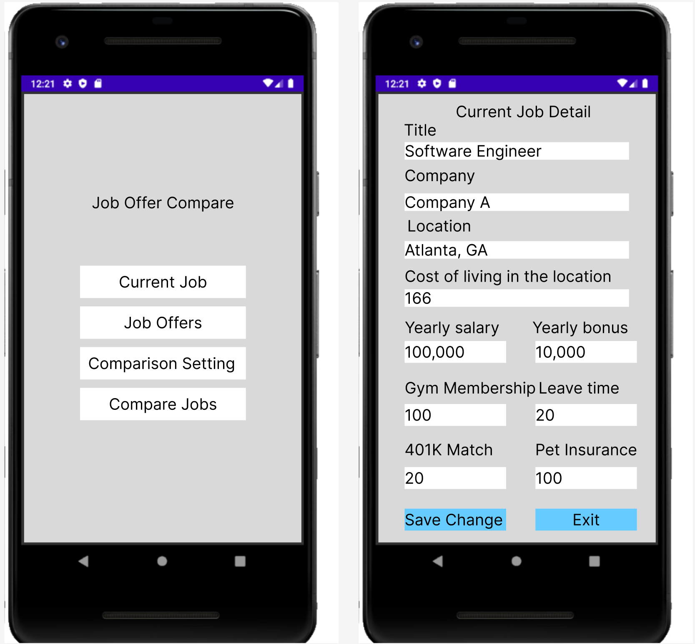
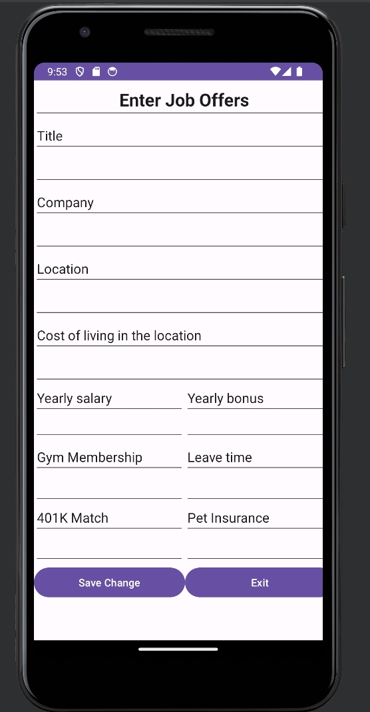
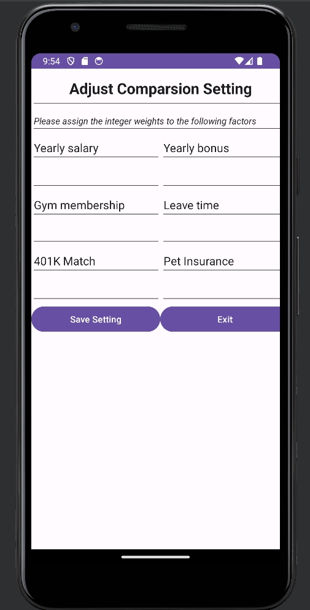
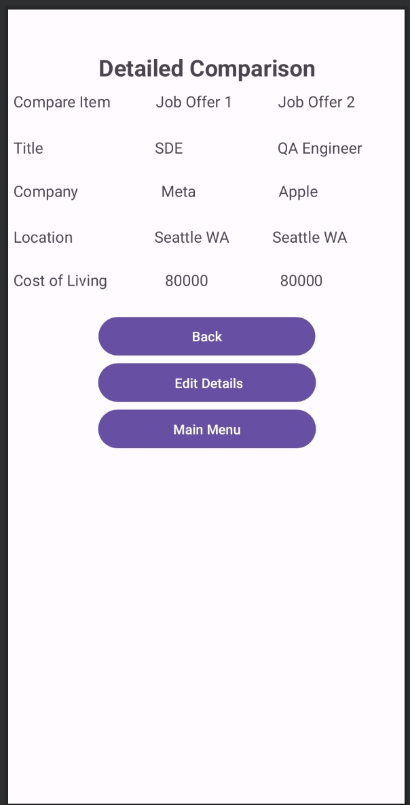
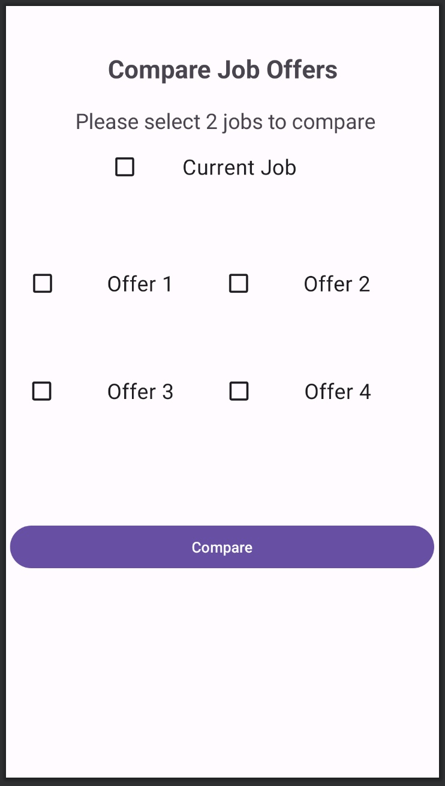

# Design Document v2
**Updated on Oct.15, 2023**
 
**Author**: Team 160 
 
## 1 Design Considerations 
 
### 1.1 Assumptions 
 
1. User can have only one current job. 

2. App will run on local Android machine and data will be stored in local database. 

3. App will only support one local user, no multiple users accessing the same copy of App at the same time. 

4. Job comparison requires at least two jobs (either current job with a job offer or 2 job offers) to start comparison. 

5. The default value for all the comparison attributes' weights are 1.

 
 
### 1.2 Constraints 
 
1. App will only run on devices which support Android and specific version. 

2. App will be developed based on Pixel 4 XL and may not work well with other devices. 

 
 
### 1.3 System Environment 
 
1. Android 12 (API 31) 

2. SQLite database 
 
## 2 Architectural Design 

### 2.1 Component Diagram

### 2.2 Deployment Diagram 

 
## 3 Low-Level Design 

### 3.1 Class Diagram

### 3.2 Other Diagrams
As we have other docs explaining the workflow of the app in detail, we will not include other diagrams here.

## 4 UserInterface Design

