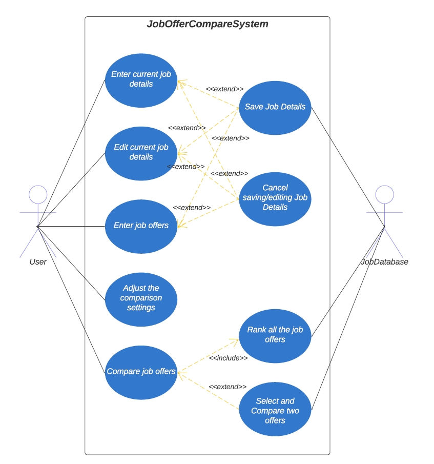

# Use Case Model 

**Author:** Team160 

## 1 Use Case Diagram 

## 2 Use Case Descriptions 

### 1. Enter current job details 

- Requirements: Allow the user to enter the current job’s details. 

- Pre-conditions: No current job details in the JobDatabase system. 

- Post-conditions: Current job’s details are either saved or discarded. 

- Scenarios:  

    - The user chooses to enter the current job details. 

    - The system displays a table of the required info for a job. 

    - The user filles in the required info of the current job. 

    - The user can choose to either save or discard the current job details they’ve entered. 

### 2. Edit current job details 

- Requirements: Allow the user to edit the current job’s details. 

- Pre-conditions: JobDatabase has the current job’s details. 

- Post-conditions: Current job’s details are either saved or discarded. 

- Scenarios:  

    - The user chooses to edit the current job details. 

    - The system displays a table with the existing details of the current job. 

    - The user updates the info of the current job. 

    - The user can choose to either save or discard the current job details they’ve updated. 

### 3. Enter job offers 

- Requirements: Allow the user to enter the details of the job offer. 

- Pre-conditions: NA. 

- Post-conditions: Job offers’ details are either saved or discarded. 

- Scenarios:  

    - The user chooses to enter the job offers’ details. 

    - The system displays a table of the required info for the job offers for the user to enter. 

    - The user filles in the required info of the job offers. 

    - The user can choose to either save or discard the job offers’ details they’ve entered. 

### 4. Save job details 

- Requirements: Allow the user to save the details of the current job or job offer. 

- Pre-conditions: The user chooses to enter/edit the current job details or enter new job offers. 

- Post-conditions: The data is saved in the JobDatabase. 

- Scenarios: 

    - The user has filled in / updated the details of the current job/job offer. 

    - The user chooses to save the info they’ve entered. 

    - The updated/new current job/job offers will be saved in the JobDatabase. 

    - The system returns to the main menu. 

### 5. Cancel saving/editing job details 

- Requirements: Allow the user to discard the details of the current job or job offer they’ve entered 

- Pre-conditions: The user chooses to enter/edit the current job details or enter new job offers. 

- Post-conditions: NA. 

- Scenarios:  

    - The user has filled in the details of the current job/job offer. 

    - The user chooses to discard the changes they’ve made. 

    - The system will jump back to the main menu and the changes will be not saved to JobDatabase. 

### 6. Adjust the comparison settings 

- Requirements: Allow the user to adjust the weights to different factors. 

- Pre-conditions: NA. 

- Post-conditions: The comparison setting are saved in the JobDatabase. 

- Scenarios:  

    - The user chooses to adjust the comparison settings. 

    - The system will display the factors and weights. 

    - The user updates the weights for different factors. 

    - The user chooses to saves changes to weights. 

    - Updated weights are saved to JobDatabase. 

    - The system returns to the main menu. 

### 7. Compare job offers 

- Requirements: Allow the user to compare job offers and/or the current job. 

- Pre-conditions: At least 2 job offers are entered or 1 current job and 1 job offer saved in the JobDatabase. 

- Post-conditions: Display all the job offers by ranking them based on the scores. 

- Scenarios:  

    - The user chooses to compare job offers. 

    - The system will display all the job offers or allow the user to choose 2 job offers to compare. 

### 8. Rank all the job offers 

- Requirements: Allow the user to see all the job offers in the JobDatabase with their ranking.  

- Pre-conditions: The user has chosen to compare job offers. 

- Post-conditions: NA. 

- Scenarios:  

    - After the user chooses to compare job offers, the system will calculate the scores for all. the job offers by extracting the comparison settings and job details from the JobDatabase. 

    - The system will display all the job offers by ranking them based on their scores. 

### 9. Select and Compare two offers 

- Requirements: Allow the user to choose 2 job offers to compare. 

- Pre-conditions: Co At least 2 job offers are entered or 1 current job and 1 job offer saved in the JobDatabase. 

- Post-conditions: The comparison results will be displayed including 2 job offers’ details. 

- Scenarios:  

    - The user selected 2 job offers he/she wants to compare. 

    - The system retrieve the scores of these 2 job offers that it has calculated before when ranking all the job offers. 

    - The system displays these 2 job offers’ details in a table. 

    - The user can choose to compare more job offers or go back to the main menu of the system. 
